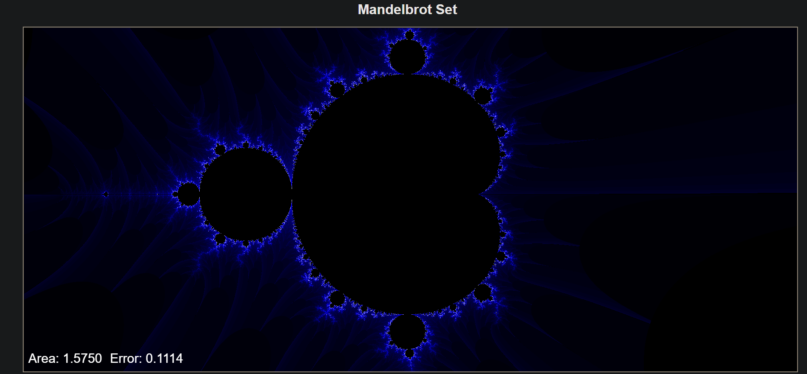

# Mandelbrot Set

## Daniel Oria Martín

Implemented with node.js, express, mocha and chai

## How to install

* Clone the repo on your machine
* npm install to install all dependencies
* npm start inside directory nodeServer to start running server locally *http://'your machine IP addr':8080*

## Image of the actual app running

This was part of an Assignment done for class.